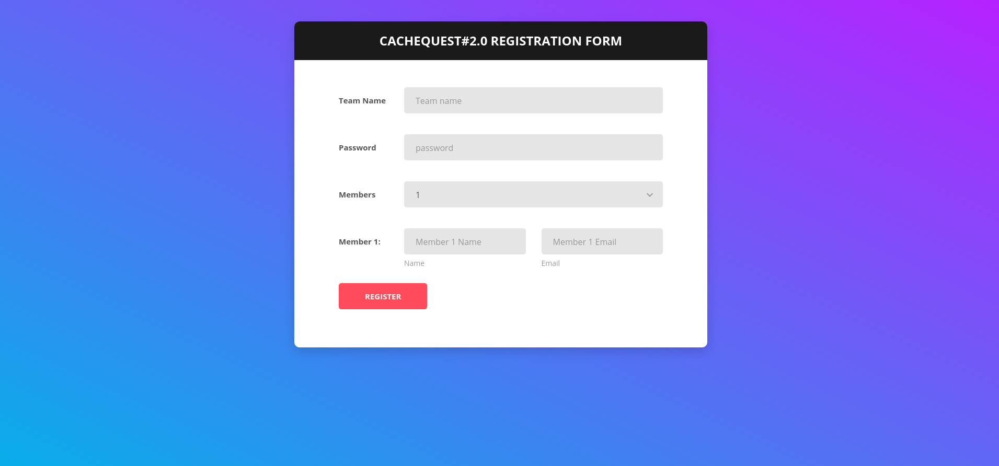
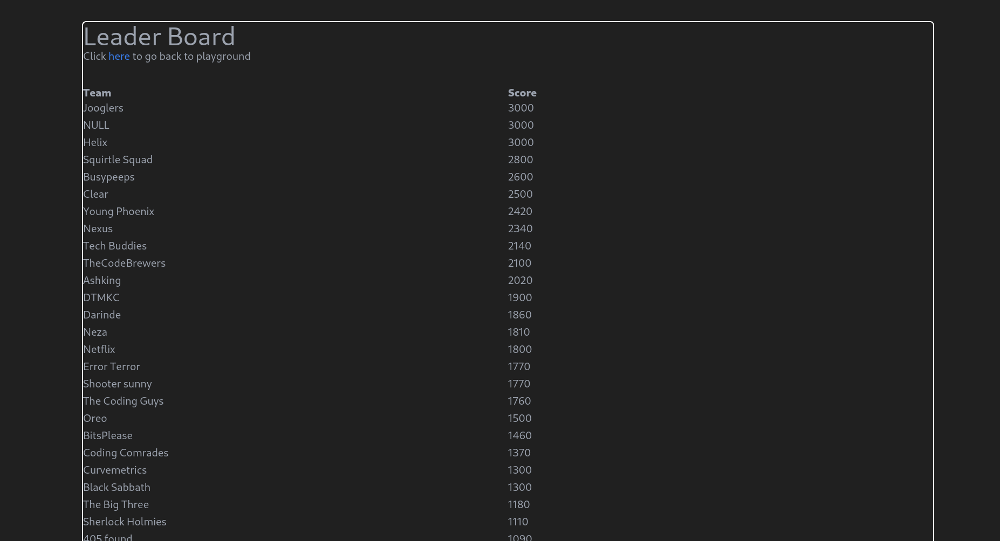
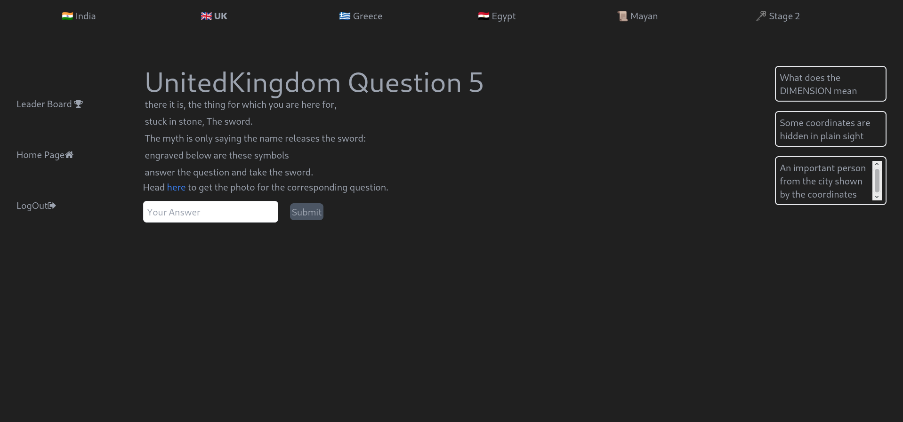
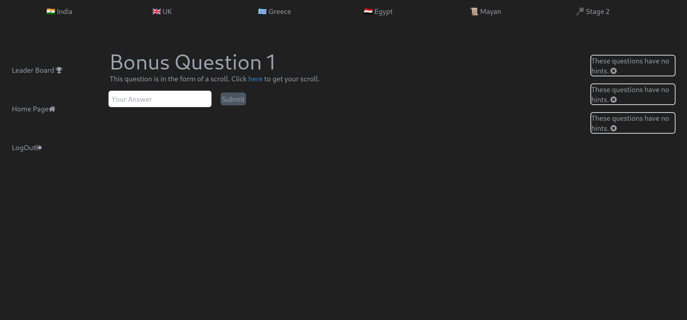

# **MLSC Scavenger Hunt Online Portal**
###### Thanks to parv(git-@parvg555) for designing the Homepage and Register WebPage. Thanks to sahaj(git-@Sahaj-Srivastava24) for designing the Login and Victory WebPages
###### Thanks to the entire MLSC Core team for designing the questions.

The portal was used to host the MLSC Online Scavenger Hunt starting at 12 AM on 27th February 2021 and ending at 5 PM on 28th February 2021(41 hours).
There were 130+ participanting teams and 12000+ answers were submitted.<br><br>

Right below are photos of the applicatin. <br>
After that is some explanation of the code that is inside app.js. <br>
At the end of this document are the answers to the questions (without explanation). <br><br>







The backend uses Passport for authentication and is attached to a MongoDB Database on MongoDB Atlas. <br><br>

The database has 2 collections: Users and Answers. Even though Users and Answers have a composition relationship (users are composed of a set of answers),
in the database it has been implimented as an assosiation relationships (every answer knows which team it was given by and each team has a list of id's
of all the answers it gave). This is because implimenting it this way made managing and quering on the database much easier.<br><br>

All the question,hints and answers are stored in constant arrays.<br>
The answers are hashed using bcrypt so that even if the source code was to get leaked only the hints and questions would get compromised,not the answers.<br>

The playground get route renders the webpage where the user will see the question. <br>
It takes country as an argument then see's how many questions have been solved, then renders the next question accordingly. <br>
The playground post route accepts answers. <br>
The admin route helps admin acconts(users with field adminPrivilege set to true) see all the answers given by each team. <br>
The teamanswerhistory renders it for one team.<br>
The gethint get request takes country as arguement and gives the requesting user one hint if they haven't yet availed all 3 hints.<br>

To use the portal 
- Git clone this repo
- run ``` npm install ``` to get all the node modules
- in the app.js file on line 24 change 
``` 
mongoose.connect("mongodb+srv://cluster0.tbblr.mongodb.net/MLSCScavengerHuntDep", {
    poolSize: 460,
    auth: {
        user: "admin-raghav",
        password: encodeURIComponent(process.env.MONGOCLUSTERPASS)
    },
    useNewUrlParser: true,
    useUnifiedTopology: true
});
 ``` 
  to
 ```
 mongoose.connect("mongodb://localhost:27017/MLSCScavengerHuntDep", {
    useNewUrlParser: true,
    useUnifiedTopology: true
});
 ```
 -make sure you have MongoDB installed and running on your system.
 - run ``` node app.js ``` to start the website on your localhost
- now just open any browser and goto localhost:3000
- enjoy the contest.

Answers <br>
INDIA : kuttanad , deepintotheforestliesaboxofcursesandrichesfilledwithgreedenvyhatredpai , champagali , 34201814 , 4980101<br>
UNITED KINGDOM : excalibur , 519874143208 , 18061942 , literally anything will work for this question, davethomas<br>
GREECE : atlantis , trident , poseidon , 277 , olympian<br>
EGYPY : sphinx , thebes , 629169196 , cairo , 231494577<br>
MAYAN : machupicchu , 0246121620 , templeofthemoon ,1413 , moonstones<br>
STAGE 2 : 12, 0163248648096 , timcook , 07112017 , 405955470<br>